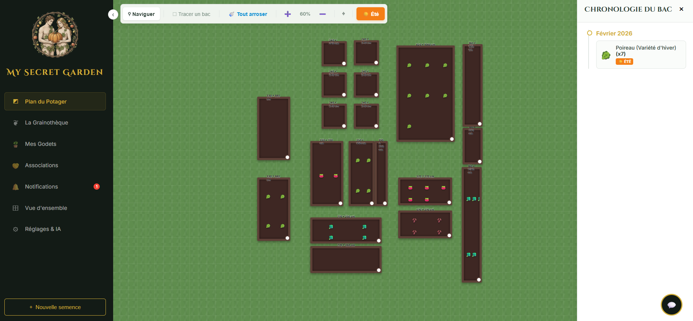
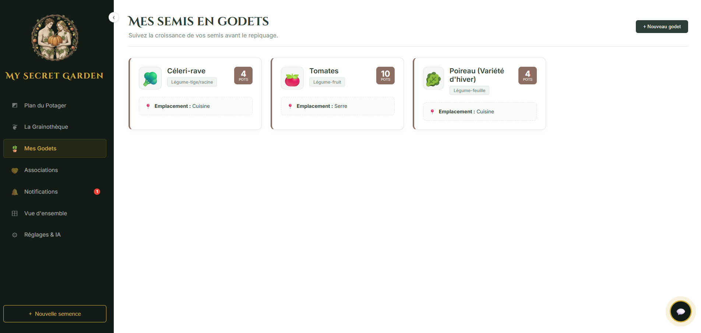
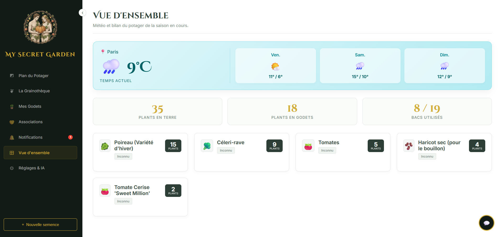
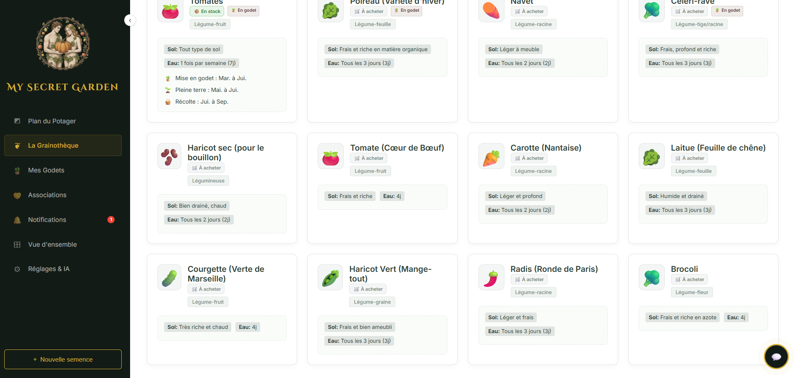

<div align="center">
  
  <h1>🍑 My Secret Garden</h1>

  <p>
    <strong>Votre assistant de jardinage personnel, interactif et intelligent.</strong>
  </p>
</div>

---

## 📖 Description

**My Secret Garden** est une application web complète conçue pour accompagner les jardiniers, du débutant à l'expert, dans la gestion de leur potager.

Elle combine une interface visuelle riche pour planifier vos cultures sur un **plan infini**, une base de données détaillée pour vos semences, et des fonctionnalités intelligentes comme des **alertes d'arrosage**, des conseils de **compagnonnage végétal**, et un **assistant IA intégré** capable d'agir directement sur votre jardin.

L'application est pensée pour être utilisée aussi bien sur grand écran que sur mobile directement au jardin.

## ✨ Fonctionnalités Clés

### 🌿 Gestion des Cultures
* **Grainothèque Complète :** Inventaire détaillé de vos semences (type, besoins en eau/sol, calendriers de semis/récolte). Gestion du stock (possédé vs à acheter).
* **Suivi des Godets (Pouponnière) :** Suivez vos semis démarrés en intérieur avant le repiquage.

### ◩ Plan du Potager Interactif
* **Carte "Infinie" :** Dessinez, déplacez et redimensionnez vos bacs de culture sur un espace illimité (zoom et pan).
* **Double Saison :** Basculez instantanément entre une vue "Été" ☀️ et "Hiver" ❄️ pour gérer vos rotations de cultures.
* **Plantation Visuelle :** Remplissez vos bacs avec des plantes dont les icônes s'affichent sur une grille dynamique.

### 🧠 Intelligence et Assistance
* **Assistant IA Gemini :** Chatbot intégré. Demandez-lui des conseils, et il peut automatiquement ajouter des graines à votre inventaire ou dessiner des bacs sur le plan pour vous !
* **Compagnonnage Végétal :** Base de données d'associations. L'application vous avertit visuellement (⚠️) si vous placez des plantes ennemies dans le même bac.
* **Alertes d'Arrosage Intelligentes :** Calcul automatique des besoins en eau par bac, basé sur la plante la plus exigeante et le dernier arrosage.

### 🔔 Notifications et Météo
* **Tableau de Bord Météo :** Prévisions locales à 3 jours.
* **Centre de Notifications :** Alertes centralisées pour l'arrosage et les tâches du calendrier (semis, récoltes à venir).
* **Webhooks Discord :**  Recevez des alertes matinales sur votre serveur Discord s'il faut arroser ou s'il pleut.

---

## 🛠 Démarrage rapide

```
docker run -p 8000:8000 -v ./data:/app/data/ emeryn/mysecretgarden:v1.0
```

### Configuration dans l'Application

Une fois l'application lancée, rendez-vous dans l'onglet **⚙️ Réglages & IA** :

1.  **Localisation :** Entrez votre Ville et Pays pour activer le widget météo.
2.  **IA Gemini :** Entrez votre clé API Google Gemini pour activer le chatbot.
3.  **Discord :** Entrez l'URL de votre Webhook Discord et l'heure souhaitée pour les alertes automatiques.

---

## 📖 Utilisation

1.  **Commencez par la Grainothèque** pour ajouter vos variétés de légumes préférées.
2.  **Allez sur le Plan du Potager**. Utilisez l'outil "Tracer un bac" (⬚) pour dessiner vos zones de culture.
3.  **Cliquez sur le bouton "🌱 Planter ici"** d'un bac pour y ajouter vos graines. Surveillez les alertes d'associations !
4.  **Quand vous arrosez**, cliquez sur le bouton "💦" du bac, ou utilisez le bouton "Tout arroser" dans le menu si vous avez fait un arrosage général.
5.  **Consultez les Notifications** régulièrement pour voir quels bacs ont soif.

---

<div align="center">
  <p>Fait avec ❤️ et beaucoup de 🍑 pour les amoureux du jardinage.</p>
</div>


<div align="center">
  
  
  
  

</div>