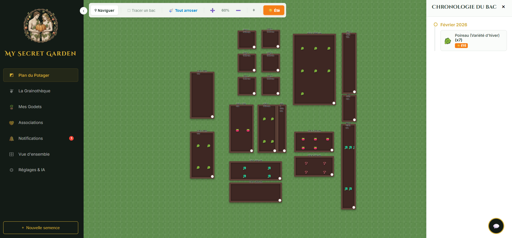
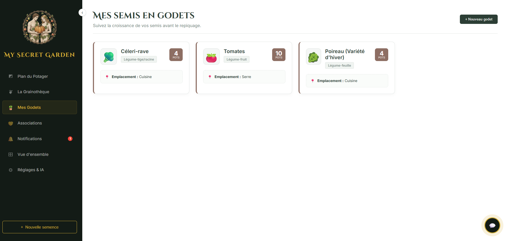
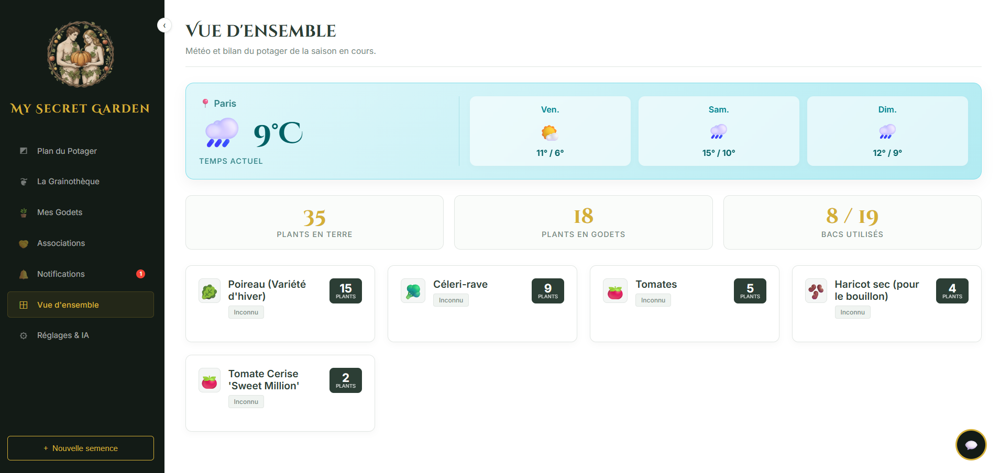
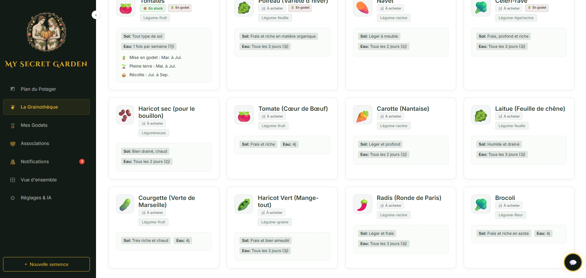

<div align="center">
  
  <h1>🍑 My Secret Garden</h1>

  <p>
    <strong>Your personal, interactive and smart gardening assistant.</strong>
  </p>
</div>

---

## 📖 Description

**My Secret Garden** is a self-hosted web app that helps gardeners, from beginners to experts, manage their vegetable garden.

It combines a visual **infinite garden plan**, a detailed seed library and smart features such as **watering alerts** and **companion planting** advice. It works on a big screen as well as on a phone, right in the garden.

The interface is available in **English** and **French**.

## ✨ Features

### 🌿 Crops
* **Seed library:** detailed inventory of your seeds (category, water and soil needs, sowing and harvest calendar, expiry date). Track what you own and what you need to buy.
* **Seedlings:** follow the seedlings you started indoors until they are planted out.
* **Potted plants:** indoor and outdoor plants with their own watering schedule.

### 🗺️ Interactive garden plan
* **Infinite map:** draw, move and resize growing beds, wooden borders, trees and decorations (zoom and pan, touch friendly).
* **Visual planting:** fill your beds with plants shown on a dynamic grid, with a planting history for every bed.

### 🧠 Assistance
* **Companion planting:** the app warns you (⚠️) when incompatible plants share a bed. Variety names are recognised in English and French.
* **Crop rotation:** a 4-year rotation guide and a needs table by plant family.
* **Smart watering alerts:** each bed's needs are computed from its thirstiest plant and its last watering.

### 🔔 Notifications & weather
* **Weather dashboard:** local 3-day forecast and frost warning.
* **Notification center:** watering alerts and calendar tasks (sowing, planting out).
* **Discord webhooks:** a daily message tells you whether to water, or that it is raining.

### 🏠 Home Assistant
* A custom integration (in the [`ha`](./ha) folder) creates a device for every bed and pot, with "needs water" sensors and "mark as watered" buttons, ready for automations (valves, notifications...). The **Home Assistant** tab of the app walks you through the setup.

---

## 🛠 Quick start

```bash
docker run -p 8000:8000 -v ./data:/app/data \
  -e APP_USERNAME=gardener -e APP_PASSWORD=change-me \
  emeryn/mysecretgarden:latest
```

or with Docker Compose:

```bash
APP_USERNAME=gardener APP_PASSWORD=change-me docker compose up -d
```

Then open `http://<server-ip>:8000`.

### 🔒 Authentication

| Variable | Default | Description |
|---|---|---|
| `APP_USERNAME` | `admin` | Username of the web interface |
| `APP_PASSWORD` | `admin` | Password of the web interface |

The app shows a warning as long as the default `admin` / `admin` credentials are in use: **change them**, especially if the app is reachable from outside your network (and put it behind HTTPS in that case).

Other tools, such as Home Assistant, never use your password: create an **API key** in **Settings → API keys**. A key can read and update the garden but cannot sign in to the interface or create other keys. Keys are stored hashed and can be revoked at any time.

### ⚙️ First steps

In **⚙️ Settings**:

1. **Language:** English or French (also used for Discord messages).
2. **Location:** enter your city to enable the weather widget and the rain detection.
3. **Discord:** paste your webhook URL and choose the time of the daily alert.

---

## 📖 Usage

1. **Start with the seed library** and add your favourite varieties.
2. **Open the garden plan** and use the "Draw a growing bed" tool to draw your beds.
3. **Hover a bed and click 🌱 "Plant here"** to add plants. Watch out for companion warnings!
4. **When you water**, click 💦 on the bed, or "Water all" in the menu after a full watering.
5. **Check the notifications** to see which beds and pots are thirsty.

---

## 🔄 Upgrading from an older version

Data from older versions (French data files such as `graines.json` or `parcelles.json`) is converted automatically at startup. The original files are kept in `data/legacy-<timestamp>/`. Backups exported by older versions can still be restored from **Settings → Backup & restore**.

The API routes and the authentication changed: update the Home Assistant integration to version 2.0, then give it a new API key when Home Assistant asks for it. The single API token of the previous version (`data/api_token`) is imported as an API key named *Legacy token*; revoke it once your tools use a new key.

---

<div align="center">
  <p>Made with ❤️ and lots of 🍑 for garden lovers.</p>
</div>

<div align="center">
  
  
  
  
</div>
